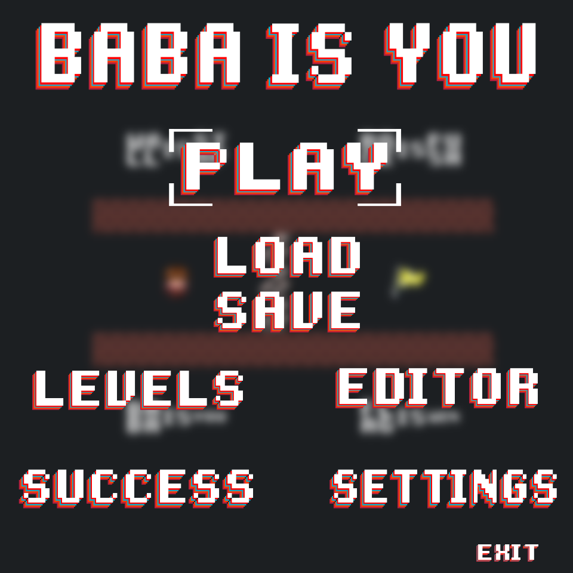
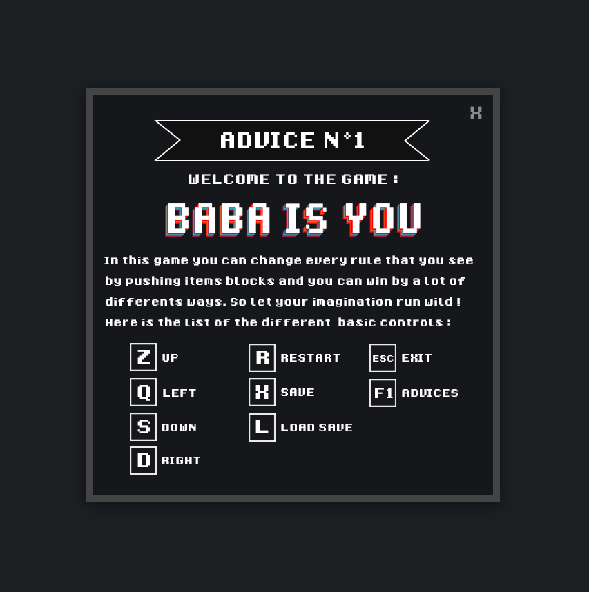
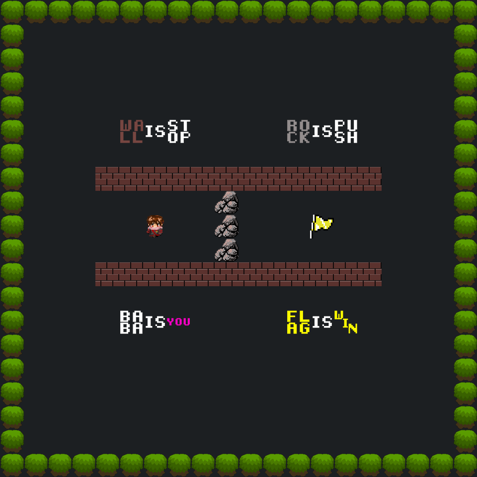
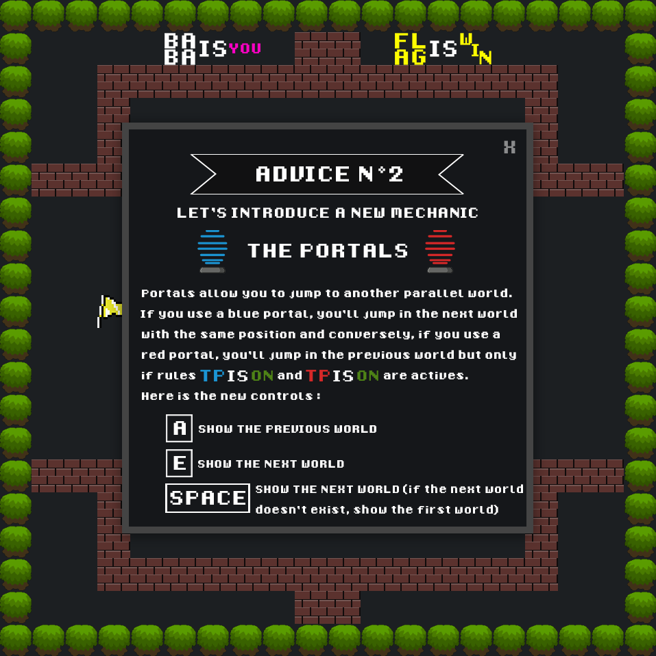

# Baba Is You
Puzzle game where the player can change rules by pushing blocks and win by a lot of different ways. Based on the game "Baba Is You" of Arvi Teikari.
The first four levels are a reproduction of the first levels of the original game and the following levels are original creations for this game.

Here is a non-exhaustive list of implemented features:
- 9 levels, 5 of which are new
- Parallel worlds have been added
- Several new items including portals have been implemented
- The user can create and load his own custom levels via the graphical level editor
- Keyboard shortcuts are editable and automatically saved
- The user can unlock achievements as he progresses through the game
- Background music in the main menu

## Build
Note: Java with JavaFx is required.
```sh
git clone https://github.com/FlorentCollin/baba-is-you
cd baba-is-you/code
make
```

## Run
```sh
make run
```

## Screenshots
### Main menu


### First Level



### Portals

